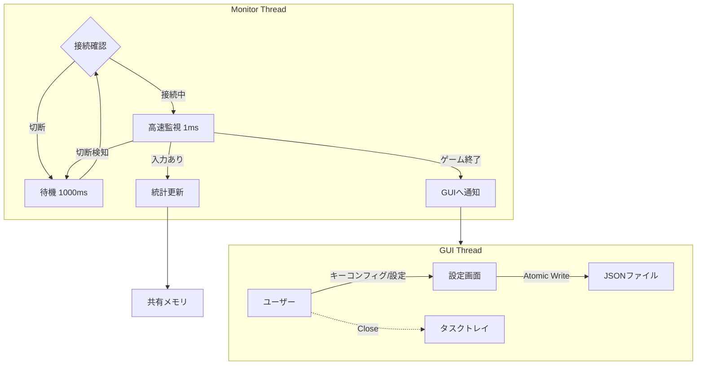

# IIDXコントローラー寿命管理ツール "SwitchLifeManager" 詳細設計書 (Rev. 2)

## 1. プロジェクト概要
本ソフトウェアは、Beatmania IIDX INFINITAS等のリズムゲームで使用されるコントローラーのマイクロスイッチ寿命を可視化・管理するためのツールである。
高精度の入力監視によりハードウェアの消耗度を管理し、チャタリング（多重反応）を検出する。
Rev.2では、接続安定性、汎用的なキーマッピング、データの安全な保存に重点を置いた設計とする。

## 2. 要件定義

### 2.1 機能要件
* **高精度入力監視と接続管理**:
    * XInputコントローラーを1ms精度で監視。
    * **ホットプラグ対応**: コントローラーの切断・再接続を動的に検知し、切断中は低負荷待機モードへ移行する。
    * **ターゲット選択**: 複数のコントローラー接続時に、監視対象（Player 1~4）を選択可能にする。
* **キーマッピング (Key Config)**:
    * コントローラーごとのボタン配置（物理ボタンIDと論理機能の対応）をユーザーが設定できる機能を持つ。
    * デフォルトプリセット（公式コン、PhoenixWAN等）を用意する。
* **チャタリング検出**:
    * リリースから再プレスまでの時間を計測し、閾値（デフォルト15ms）未満をチャタリングとして記録。
    * **統計の取り扱い**: チャタリングとして検出した再プレスは、寿命管理の「意図した押下回数」とは分けるため **`total_presses` には含めない**。
    * **発生率の定義（推奨）**:
        * 押下エッジ基準の比率: `chatter_rate_press_edge = total_chatters / (total_presses + total_chatters)`
        * リリース基準の比率: `chatter_rate_release = total_chatter_releases / total_releases`
        * どちらをUIに出すかは目的次第だが、「離しチャタリング」を知りたい場合はリリース基準が解釈しやすい。
* **寿命可視化**:
    * スイッチカタログ（型番・定格寿命）に基づき、寿命残量を可視化する。
* **プロセス連携・自動レポート**:
    * `bm2dx.exe` の終了を検知し、ウィンドウを自動ポップアップしてレポートを表示。
* **常駐・トレイ格納**:
    * 「閉じる」でタスクトレイ格納。トレイアイコンから復帰・終了操作。

### 2.2 非機能要件
* **データ整合性 (Atomic Save)**:
    * データの保存時は「一時ファイル書き込み → リネーム」の手順を踏み、電源断やクラッシュ時のデータ破損（ゼロバイト化）を防止する。
* **低負荷**:
    * 監視スレッドは `sleep` を活用し、CPU使用率を極小化する。
    * 切断時はポーリング頻度を落とす（1ms → 1000ms）。

## 3. アーキテクチャ設計

### 3.1 技術スタック (変更・追加分のみ)
| カテゴリ | 選定技術 | 理由 |
| :--- | :--- | :--- |
| **言語** | Rust | 高速性、メモリ安全性、Win32 APIアクセスの容易さ |
| **GUI** | eframe (egui) | 軽量、即時モードGUI、Rust製 |
| **入力監視** | windows-rs | エラーハンドリング (`ERROR_DEVICE_NOT_CONNECTED`) を強化 |
| **プロセス監視** | sysinfo | クロスプラットフォームかつ軽量なプロセス管理 |
| **データ保存** | tempfile + Win32 (`MoveFileExW`) | 一時ファイル生成は `tempfile`、Windowsでの「既存ファイルを置換するアトミックリネーム」は `MoveFileExW(MOVEFILE_REPLACE_EXISTING | MOVEFILE_WRITE_THROUGH)` を使用する |
| **常駐制御** | tray-icon | タスクトレイアイコン管理のデファクトスタンダード |

### 3.2 処理フロー概念図
接続状態（Connected / Disconnected）によるステートマシンを監視スレッドに導入する。



## 4. データ構造設計

### 4.1 データモデルの変更点
「物理ボタンID」と「論理機能（1鍵など）」の結合を疎結合にするため、マッピング定義を分離する。

* **LogicalKey**: アプリケーションが扱う論理的なキー（Key1, Key2, Turntable...）。
* **ButtonMap**: 物理ボタンID（ビットマスク）とLogicalKeyの対応表。
* **Atomic Persistence**: 保存時は必ず `.tmp` ファイルを経由する。

補足（実装上の注意）:

* JSONのオブジェクトキーは文字列であるため、`HashMap<LogicalKey, ...>` をそのまま `serde` に任せると、`Other(u16)` の表現が想定（例: `"Other-12"`）と一致しない。
    * 対応策: `LogicalKey` に `Display`/`FromStr` を実装し、`serde_with::DisplayFromStr` 等で **必ず文字列キー** としてシリアライズする。
    * あるいは JSON側を配列形式（`[{"logical":"Key1","physical":4096}, ...]`）にして、キーを文字列にしない。
    * 本設計のJSON例では `mapping.bindings` と `switches` の両方がこの影響を受ける（どちらも `LogicalKey` をキーにするため）。

* XInputのボタンは `wButtons`（16bitビットマスク）で表現されるため、物理ボタンIDは基本的に `u16` を前提にする。
    * ただしトリガーやスティックはアナログ値であり、ビットマスクとは別系統の扱いになる（Turntableをアナログ軸で取りたい場合は別マッピング種別が必要）。

* `schema_version` は永続化フォーマットのバージョンである。
    * フィールド追加・名称変更等の破壊的変更が入る場合は、この値を上げて読み込み時にマイグレーションする。

```json
{
    "schema_version": 1,
    "config": {
        "target_controller_index": 0,
        "chatter_threshold_ms": 15,
        "polling_rate_ms_connected": 1,
        "polling_rate_ms_disconnected": 1000
    },
    "mapping": {
        "profile_name": "Custom IIDX Mapping",
        "bindings": {
            "Key1": 4096,
            "Key2": 8192,
            "Turntable": 64
        }
    },
    "switches": {
        "Key1": {
            "switch_model_id": "omron_d2mv_01_1c3",
            "stats": {
                "total_presses": 150200,
                "total_releases": 150199,
                "total_chatters": 12,
                "total_chatter_releases": 10,
                "last_session_presses": 450
            }
        },
        "Key2": { ... }
    }
}
```

```rust
// 論理キーの定義
#[derive(Hash, Eq, PartialEq, Clone, Serialize, Deserialize)]
enum LogicalKey {
    Key1, Key2, Key3, Key4, Key5, Key6, Key7,
    Turntable,
    Start, Select, E1, E2,
    // JSONキーとして使うため、文字列化の考慮が必要 (例: "Other-12")
    Other(u16)
}

// データルート
struct UserProfile {
    schema_version: u32,
    config: AppConfig,
    mapping: ButtonMap,
    switches: HashMap<LogicalKey, SwitchData>,
}

struct ButtonMap {
    profile_name: String,
    bindings: HashMap<LogicalKey, u16>, // Logical -> Physical(Bitmask)
}

struct SwitchData {
    switch_model_id: String,
    stats: ButtonStats,
}
```

## 5. ロジック詳細設計

### 5.1 堅牢な監視ループ (Monitor Loop)
1.  **接続チェック**: `XInputGetState(target_index)` を実行。
2.  **エラーハンドリング**:
    * `ERROR_SUCCESS`: **接続中モード**へ。
        * タイマー精度は「接続状態に入ったタイミング」で `timeBeginPeriod(1)` を有効化し、「切断へ遷移したタイミング」で `timeEndPeriod(1)` を呼び戻す。
        * 入力判定ロジック実行（前回設計同様）。
        * `sleep(1ms)`。
    * `ERROR_DEVICE_NOT_CONNECTED`: **切断モード**へ。
        * GUIステータスを「切断中」に更新。
        * `sleep(1000ms)`（再接続待ちのCPU負荷低減）。
3.  **状態遷移時の処理**:
    * 切断 → 接続: プロセス監視やタイマー精度設定を再初期化。

補足（実装上の注意）:

* キー割り当てや統計更新で「押下エッジ」を使うため、`wButtons` の現在値だけでなく前回値を保持し、`pressed = (now & !prev)` のように立ち上がりを検出する。
* 1msスリープは環境により揺れるため、実測で許容できない場合は待機戦略（`sleep` + 誤差吸収、または高分解能タイマー）を検討する。

離しチャタリングの計測（推奨アルゴリズム）:

* ボタンごとに `last_release_at`（直近のリリース時刻）と `chatter_cooldown_until` を保持する。
* リリースエッジ検出時:
    * `total_releases += 1`
    * `last_release_at = now`
* プレスエッジ検出時:
    * `now < chatter_cooldown_until` の間は、押下・チャタリングのどちらも数えない（多重バウンスによる過剰カウント抑制）。
    * `last_release_at` があり、`now - last_release_at < chatter_threshold_ms` の場合:
        * `total_chatters += 1`
        * このリリースで初めてのチャタリングなら `total_chatter_releases += 1`
        * **このプレスは `total_presses` に含めない**
        * `chatter_cooldown_until = now + chatter_threshold_ms`（または固定ガード時間）
    * 上記以外の場合:
        * `total_presses += 1`

### 5.2 安全なファイル保存 (Atomic Write)
1.  データ保存リクエスト発生（終了時、オートセーブ）。
2.  `tempfile::Builder` を使用し、**保存先ディレクトリ内**に一時ファイルを作成（クロスデバイスエラー回避）。
3.  JSONシリアライズしてTempFileに書き込み。
4.  `flush` の後、可能なら `sync_all` でファイル内容をディスクへフラッシュする（耐障害性向上）。
5.  置換リネームを実行する。
    * Windows: `MoveFileExW(tmp, dest, MOVEFILE_REPLACE_EXISTING | MOVEFILE_WRITE_THROUGH)` により **既存ファイルを置換** する。
    * Windows以外: `std::fs::rename(tmp, dest)`（同一ディレクトリ内であれば原子的に置換される）
6.  失敗時はエラーログを出力し、元のファイルを保持する。

## 6. UI/UX設計

### 6.1 キーコンフィグ画面 (Key Config Modal)
* **UI構成**:
    * 左側: 論理キーリスト（1鍵、2鍵...）。
    * 右側: 現在割り当てられているボタンID。
* **設定フロー**:
    1.  ユーザーがリストから「1鍵」を選択し「設定」ボタンを押下。
    2.  ダイアログ「コントローラーのボタンを押してください...」を表示。
    3.  アプリは全ボタン入力を監視（前回状態との差分で「新しく押されたボタン」を検出）。
    4.  最初に検出した押下エッジのビットマスクを取得し、マッピングを更新。
        * 押しっぱなし状態を誤って拾わないよう、ダイアログ表示時点の `wButtons` を基準（初期値）として除外する。

### 6.2 メイン画面のステータス表示
* ヘッダー部にインジケータを追加。
    * 🟢 **Connected (Player 1)**: 正常監視中。
    * 🔴 **Disconnected**: コントローラー未検出。
    * 🔵 **Game Running**: INFINITAS起動中。

## 7. 実装ロードマップ (Rev. 2)

1.  **Phase 1: コア & データ保全**
    * データ構造の実装（LogicalKey, Atomic Write）。
    * 監視スレッドの実装（切断時の待機ロジック含む）。
2.  **Phase 2: GUI & キーコンフィグ**
    * `eframe` 基本実装。
    * **キー割り当て設定画面**の実装（これが無いと実機テストが困難なため前倒し）。
    * リアルタイム入力モニター（デバッグ用）。
3.  **Phase 3: 完成度向上**
    * メインダッシュボード（寿命バー表示）。
    * プロセス監視と自動ポップアップ。
    * トレイ格納機能。