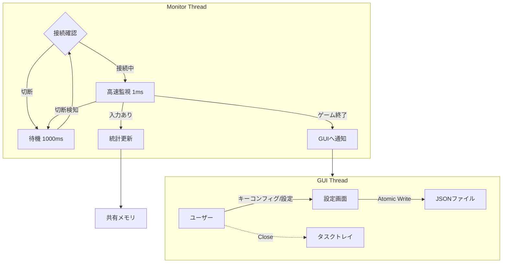

# IIDXコントローラー寿命管理ツール "SwitchLifeManager" 詳細設計書 (Rev. 2)

> 追補（Rev. 3）: GUI基盤を eframe から **Tauri v2（React UI）** へ移行する。
> 本書のDomain/Usecase/監視ループ/永続化の基本方針は維持しつつ、UI層・常駐（トレイ）・IPCの設計を更新する。

## 1. プロジェクト概要
本ソフトウェアは、Beatmania IIDX INFINITAS等のリズムゲームで使用されるコントローラーのマイクロスイッチ寿命を可視化・管理するためのツールである。
高精度の入力監視によりハードウェアの消耗度を管理し、チャタリング（多重反応）を検出する。
Rev.2では、接続安定性、汎用的なキーマッピング、データの安全な保存に重点を置いた設計とする。

## 2. 要件定義

### 2.1 機能要件
    *   **高精度入力監視と接続管理**:
    *   **DirectInput (HID) / XInput ハイブリッド対応**:
        *   **DirectInput (HID)**: デフォルトの入力方式。DJ DAO PhoenixWAN等のIIDXコントローラー（HID準拠）をサポートするため、汎用的なゲームパッドライブラリ (`gilrs` 等) を採用する。最大32ボタンまでのビットマスクをサポート。
        *   **XInput**: 従来のXInput方式も設定により選択可能として残す。
    *   **ホットプラグ対応**: コントローラーの切断・再接続を動的に検知し、切断中は低負荷待機モードへ移行する。
    *   **ターゲット選択**: 複数のコントローラー接続時に、監視対象（ID指定）を選択可能にする。
* **キーマッピング (Key Config)**:
    * コントローラーごとのボタン配置（物理ボタンIDと論理機能の対応）をユーザーが設定できる機能を持つ。
    * デフォルトプリセット（公式コン、PhoenixWAN等）を用意する。
    * 割り当て対象はデジタルボタンのビットマスク（**u32**）とする。
* **チャタリング検出**:
    * リリースから再プレスまでの時間を計測し、閾値（デフォルト15ms）未満をチャタリングとして記録。
    * **統計の取り扱い**: チャタリングとして検出した再プレスは、寿命管理の「意図した押下回数」とは分けるため **`total_presses` には含めない**。
    * **発生率の定義（推奨）**:
        * 押下エッジ基準の比率: `chatter_rate_press_edge = total_chatters / (total_presses + total_chatters)`
        * リリース基準の比率: `chatter_rate_release = total_chatter_releases / total_releases`
        * どちらをUIに出すかは目的次第だが、「離しチャタリング」を知りたい場合はリリース基準が解釈しやすい。
* **寿命可視化**:
    * スイッチカタログ（型番・定格寿命）に基づき、寿命残量を可視化する。
* **プロセス連携・自動レポート**:
    * `bm2dx.exe` の終了を検知し、ウィンドウを自動ポップアップしてレポートを表示。
    * **セッションの定義**: 「ゲームプロセス（`bm2dx.exe`）の起動〜終了」を1セッションとし、`last_session_presses` 等のセッション系カウンタはゲーム起動検知時に0へリセットして終了時にレポートに使用する（累計系カウンタは継続加算）。
* **常駐・トレイ格納**:
    * 「閉じる」でタスクトレイ格納。トレイアイコンから復帰・終了操作。
* **入力テスター機能 (New)**:
    * ゲームプロセスの起動有無に関わらず、コントローラーの入力状態をリアルタイムに可視化する機能。
    * **ピアノ鍵盤状の表示**: 1-7鍵を実際のIIDXコントローラーのように互い違いに配置（ピアノレイアウト）し、直感的な確認を可能にする。
    * ボタンごとのON/OFF状態をランプ等で表示。
    * チャタリング発生時に視覚的なフィードバック（警告色など）を行う。

### 2.2 非機能要件
* **データ整合性 (Atomic Save)**:
    * データの保存時は「一時ファイル書き込み → リネーム」の手順を踏み、電源断やクラッシュ時のデータ破損（ゼロバイト化）を防止する。
* **低負荷**:
    * 監視スレッドは `sleep` を活用し、CPU使用率を極小化する。
    * 切断時はポーリング頻度を落とす（1ms → 1000ms）。

## 3. アーキテクチャ設計

### 3.1 技術スタック (変更・追加分のみ)
※ 本節の表は Rev.2（eframe採用時点）の技術選定。Tauri移行後の差分は「9. Tauri移行差分（Rev. 3 追補）」を参照。
| カテゴリ | 選定技術 | 理由 |
| :--- | :--- | :--- |
| **言語** | Rust | 高速性、メモリ安全性、Win32 APIアクセスの容易さ |
| **GUI** | eframe (egui) | 軽量、即時モードGUI、Rust製 |
| **入力監視** | gilrs / windows-rs | **gilrs**: クロスプラットフォームかつDirectInput/XInput両対応のゲームパッド管理。<br>**windows-rs**: XInput専用モードや低レイヤ操作用。 |
| **プロセス監視** | sysinfo | クロスプラットフォームかつ軽量なプロセス管理 |
| **データ保存** | tempfile + Win32 (`MoveFileExW`) | 一時ファイル生成は `tempfile`、Windowsでの「既存ファイルを置換するアトミックリネーム」は `MoveFileExW(MOVEFILE_REPLACE_EXISTING | MOVEFILE_WRITE_THROUGH)` を使用する |
| **常駐制御** | tray-icon | タスクトレイアイコン管理のデファクトスタンダード |

### 3.2 処理フロー概念図
接続状態（Connected / Disconnected）によるステートマシンを監視スレッドに導入する。



### 3.3 スレッド間共有と同期方針（実装指針）
監視スレッドは高頻度（接続中 1ms）で状態更新を行うため、GUIスレッドとの共有は「低コスト」「読み取り優先」を基本方針とする。

* 共有データは「GUI表示に必要なスナップショット（集計済み）」に限定し、巨大な構造体の頻繁なクローンを避ける。
* 実装候補（いずれか1つに統一）:
    * `RwLock<Snapshot>`: 監視側が短時間で書き換え、GUI側は読取ロックで参照。
    * 参照の差し替え（例: `ArcSwap`）: 監視側が `Snapshot` を生成し参照を原子的に差し替え、GUIはロックなしで読む。
* 監視スレッド→GUI通知（例: 接続状態変化、ゲーム終了検知）は、スナップショットのポーリングではなくチャンネル（`std::sync::mpsc` / `crossbeam_channel`）でイベントとして送る。

状態更新の直列化（実装指針）:

* `Snapshot` はGUIが読むための **読み取り専用ビュー** とし、GUIから直接ミューテートしない。
* ユーザー操作（ターゲット変更、キーマッピング更新、交換/リセット等）は「コマンド」として監視スレッドへ送信し、監視スレッド側で入力処理と同一の文脈で直列に適用する。
    * これにより、統計更新（1ms）と交換/リセットが同時に走ってカウンタが不整合になる競合を避ける。
    * 実装例: `Command::UpdateMapping {..}` / `Command::ReplaceSwitch { logical_key, new_model_id }` / `Command::ResetStats { logical_key }`

`Snapshot` に含める項目（推奨）:

* 接続状態: `Connected/Disconnected`、対象コントローラindex（Player 1〜4相当）
* 最終入力時刻（任意）: 「監視が動いている」ことの可視化用
* ゲーム稼働状態: `GameRunning`（`bm2dx.exe` 検知結果）
* 設定の要約: `chatter_threshold_ms`、polling周期（接続中/切断中）
* マッピングの要約: `profile_name`、各 `LogicalKey -> physical(u16)`（表示に必要な範囲）
* 統計（キーごと）:
    * `total_presses / total_releases / total_chatters / total_chatter_releases / last_session_presses`
    * 寿命可視化に必要な派生値（残量%など）は、GUI側で計算するかSnapshotに含めるかをどちらかに統一
* 保存状態: `last_save_at`、`last_save_result(Ok/Err + message)`
* 直近イベントの要約（任意）: GUIで簡易ログを出す場合のリングバッファ（例: 最大50件）

監視→GUIイベント種別（推奨）:

* `ConnectionChanged(Connected/Disconnected)`
* `TargetControllerChanged(index)`（ユーザー操作で変更した場合の反映用）
* `GameStarted` / `GameExited`（レポート表示トリガ）
* `SaveSucceeded` / `SaveFailed(error)`（オートセーブ/終了時保存の結果通知）

責務分離と更新頻度（実装指針）:

* 監視スレッドは「入力取得・エッジ検出・統計の累積」を担当し、GUIスレッドは「表示」と「ユーザー操作の受付」を担当する。
* GUIは毎フレーム（例: 30〜60Hz）に最新の `Snapshot` を読む前提とし、監視側の1ms更新に追従するための同期待ち（毎msロック取得等）は行わない。
* 寿命残量%やチャタリング率などの派生値は、「GUI側で都度計算」または「監視側で `Snapshot` に含める」のどちらかに統一し、両方で別々に計算しない。

## 4. データ構造設計

### 4.1 データモデルの変更点
「物理ボタンID」と「論理機能（1鍵など）」の結合を疎結合にするため、マッピング定義を分離する。

* **LogicalKey**: アプリケーションが扱う論理的なキー（Key1, Key2, Turntable...）。
* **ButtonMap**: 物理ボタンID（ビットマスク）とLogicalKeyの対応表。
* **Atomic Persistence**: 保存時は必ず `.tmp` ファイルを経由する。

補足（実装上の注意）:

* JSONのオブジェクトキーは文字列であるため、`HashMap<LogicalKey, ...>` をそのまま `serde` に任せると、`Other(u16)` の表現が想定（例: `"Other-12"`）と一致しない。
    * 対応策: `LogicalKey` に `Display`/`FromStr` を実装し、`serde_with::DisplayFromStr` 等で **必ず文字列キー** としてシリアライズする。
    * あるいは JSON側を配列形式（`[{"logical":"Key1","physical":4096}, ...]`）にして、キーを文字列にしない。
    * 本設計のJSON例では `mapping.bindings` と `switches` の両方がこの影響を受ける（どちらも `LogicalKey` をキーにするため）。

* XInputのボタンは `wButtons`（16bitビットマスク）で表現されるが、DirectInput等の多ボタンコントローラーをサポートするため、物理ボタンIDは内部的に **u32** で扱う。

* `schema_version` は永続化フォーマットのバージョンである。
    * フィールド追加・名称変更等の破壊的変更が入る場合は、この値を上げて読み込み時にマイグレーションする。
    * 未知の `schema_version` を読み込んだ場合は、データ破損を避けるため **読み込みを中止** し、ユーザーへエラー表示する。

メンテナンス（交換）と統計のスコープ（仕様）:

* `switches[LogicalKey].stats.total_*` は「現在装着されているスイッチ（現行個体）」に対する累計とし、スイッチ交換を行った場合は **0へリセット** する。
    * リセット対象: `total_presses / total_releases / total_chatters / total_chatter_releases / last_session_presses`
* 交換操作では `switch_model_id` を更新できる（同型へ交換した場合も記録目的で実施可能）。
* 交換によるリセットは不可逆とし、実行前に確認ダイアログを出す。
* 交換前の値は後追いできるよう、少なくともログへ記録する（推奨: 日時、対象 `LogicalKey`、旧/新 `switch_model_id`、交換前の各累計値）。
* 一般的なメンテナンスサイクルの考え方:
    * 定期点検（例: 一定期間ごと）と、状態基準（チャタリング率上昇、寿命バーが閾値を下回る、体感の違和感）を併用し、必要時に交換→リセットを行う。
    * 本ツールは「交換タイミングの判断材料（寿命残量・チャタリング傾向）」を提供し、交換実施後は統計を新しい個体として再スタートできることを保証する。

保存先（実装指針）:

* ユーザーデータはユーザーごとのアプリデータ領域に保存する（例: Windowsは `%LOCALAPPDATA%/SwitchLifeManager/`）。
* 設定・統計のデフォルト保存ファイル例: `profile.json`

```json
{
    "schema_version": 1,
    "config": {
        "target_controller_index": 0,
        "input_method": "DirectInput",
        "chatter_threshold_ms": 15,
        "polling_rate_ms_connected": 1,
        "polling_rate_ms_disconnected": 1000
    },
    "mapping": {
        "profile_name": "PhoenixWAN Default",
        "bindings": {
            "Key1": 8,
            "Key2": 1,
            "E1": 1024
        }
    },
    "switches": {
        "Key1": {
            "switch_model_id": "omron_d2mv_01_1c3",
            "stats": { ... }
        }
    }
}
```

```rust
// 論理キーの定義
#[derive(Hash, Eq, PartialEq, Clone, Serialize, Deserialize)]
enum LogicalKey {
    Key1, Key2, Key3, Key4, Key5, Key6, Key7,
    // PhoenixWAN等に合わせて E1-E4 を採用 (Start/Select/Turntableは除外)
    E1, E2, E3, E4,
    // JSONキーとして使うため、文字列化の考慮が必要 (例: "Other-12")
    Other(u16)
}

// データルート
struct UserProfile {
    schema_version: u32,
    config: AppConfig,
    mapping: ButtonMap,
    switches: HashMap<LogicalKey, SwitchData>,
    switch_history: Vec<SwitchHistoryEntry>,
}
```

## 5. ロジック詳細設計

### 5.1 堅牢な監視ループ (Monitor Loop)
1.  **接続チェック**: `XInputGetState(target_index)` を実行。
2.  **エラーハンドリング**:
    * `ERROR_SUCCESS`: **接続中モード**へ。
        * タイマー精度は「接続状態に入ったタイミング」で `timeBeginPeriod(1)` を有効化し、「切断へ遷移したタイミング」で `timeEndPeriod(1)` を呼び戻す。
        * 入力判定ロジック実行（前回設計同様）。
        * `sleep(1ms)`。
    * `ERROR_DEVICE_NOT_CONNECTED`: **切断モード**へ。
        * GUIステータスを「切断中」に更新。
        * `sleep(1000ms)`（再接続待ちのCPU負荷低減）。
3.  **状態遷移時の処理**:
    * 切断 → 接続: プロセス監視やタイマー精度設定を再初期化。

補足（実装上の注意）:

* キー割り当てや統計更新で「押下エッジ」を使うため、`wButtons` の現在値だけでなく前回値を保持し、`pressed = (now & !prev)` のように立ち上がりを検出する。
* 1msスリープは環境により揺れるため、実測で許容できない場合は待機戦略（`sleep` + 誤差吸収、または高分解能タイマー）を検討する。

停止・例外経路（実装指針）:

* 常駐や終了処理を考慮し、監視スレッドは「停止要求」を受け取って安全に抜けられる構造にする（例: `AtomicBool` の終了フラグ + チャンネルによる即時wake）。
* `timeBeginPeriod(1)` / `timeEndPeriod(1)` は呼び忘れがシステム全体に影響するため、可能ならRAIIで管理し「スレッド終了・エラー時でも必ず `timeEndPeriod`」が実行されるようにする。

離しチャタリングの計測（推奨アルゴリズム）:

* ボタンごとに `last_release_at`（直近のリリース時刻）と `chatter_cooldown_until` を保持する。
* リリースエッジ検出時:
    * `total_releases += 1`
    * `last_release_at = now`
* プレスエッジ検出時:
    * `now < chatter_cooldown_until` の間は、押下・チャタリングのどちらも数えない（多重バウンスによる過剰カウント抑制）。
        * 本仕様では、cooldown期間に発生した「本物の再押下」も統計上は無視してよい前提とする（IIDX用途での過剰カウント抑制を優先）。
    * `last_release_at` があり、`now - last_release_at < chatter_threshold_ms` の場合:
        * `total_chatters += 1`
        * このリリースで初めてのチャタリングなら `total_chatter_releases += 1`
        * **このプレスは `total_presses` に含めない**
        * `chatter_cooldown_until = now + chatter_threshold_ms`（または固定ガード時間）
    * 上記以外の場合:
        * `total_presses += 1`

### 5.2 安全なファイル保存 (Atomic Write)
1.  データ保存リクエスト発生（終了時、オートセーブ）。
2.  `tempfile::Builder` を使用し、**保存先ディレクトリ内**に一時ファイルを作成（クロスデバイスエラー回避）。
3.  JSONシリアライズしてTempFileに書き込み。
4.  `flush` の後、可能なら `sync_all` でファイル内容をディスクへフラッシュする（耐障害性向上）。
5.  置換リネームを実行する。
    * Windows: `MoveFileExW(tmp, dest, MOVEFILE_REPLACE_EXISTING | MOVEFILE_WRITE_THROUGH)` により **既存ファイルを置換** する。
    * Windows以外: `std::fs::rename(tmp, dest)`（同一ディレクトリ内であれば原子的に置換される）
6.  失敗時はエラーログを出力し、元のファイルを保持する。

運用上の追加指針:

* `sync_all` は「一時ファイル」に対して行う。必要に応じて「保存先ディレクトリの `sync_all`」も検討する（クラッシュ耐性向上）。
* 置換リネームが失敗する場合（他プロセスが掴む等）に備え、短いリトライ（例: 3回、各50〜100ms待ち）を入れるかどうかを実装で選択する。
* 保存失敗はサイレントにせず、GUI側で分かる形にするため「最後の保存結果（成功/失敗メッセージ・時刻）」を状態として保持する。

## 6. UI/UX設計

### 6.1 キーコンフィグ画面 (Settings Tab)
*   **UI構成**:
    *   キー一覧（Key1〜7, E1〜E4）と現在のバインディング値（Hex）を表示。
    *   各キーに対し「Set」ボタンを配置。
    *   **一括リセット**: 「Reset to Default Mapping」ボタンにより、PhoenixWAN向けデフォルト設定へ即座に復帰可能。
*   **設定フロー（学習機能）**:
    1.  ユーザーが「Set」ボタンを押下すると、モーダルダイアログまたは入力待ち状態へ移行。
    2.  コントローラーの任意のボタンを押すと、そのボタン（ビットマスク）を対象キーに割り当てる。
    3.  **重複解消**: 割り当てようとしたボタンが既に別のキーで使用されていた場合、**旧キーの割り当てを解除（0/Unbound）** し、新キーへの割り当てを優先する。これにより、項目が消失することなく設定の競合を解消する。

### 6.2 メイン画面 (Dashboard)
*   **寿命可視化**:
    *   各スイッチの残存寿命をプログレスバーで表示。
    *   **カラーコーディング**: 緑(>50%) → 黄(>25%) → 赤(<=25%)。
    *   寿命超過時もバー表示は0%で停止し、数値のみで超過状況を確認可能。
*   **スイッチ管理機能**:
    *   **モデル選択**: 各スイッチに対し、装着されているマイクロスイッチのモデル（Omron 50g等）をプルダウンで選択可能。選択に応じて定格寿命が再計算される。
    *   **統計リセット**: 「Reset」ボタンにより、スイッチ交換時に統計を0へリセット可能。
    *   **一括変更 (Bulk Actions)**: 
        *   各行のチェックボックスで対象キーを選択。
        *   上部の「Bulk Actions」エリアで、選択したキーのモデルを一括変更、または統計を一括リセット可能。

### 6.3 履歴画面 (History Tab) (New)
*   **目的**: スイッチの交換や統計リセットの履歴を閲覧する。
*   **表示内容**:
    *   日時、対象キー、イベント種別（Replace/Reset/ManualEdit）、旧モデル/新モデル、リセット直前の統計値。
    *   JSONデータ内の `switch_history` 配列をソースとする。

### 6.4 入力テスター画面 (Input Tester)
* **目的**: ゲームを起動せずにスイッチの反応やチャタリングを確認するための診断モード。
* **表示内容**:
    * **ピアノレイアウト**: 鍵盤1〜7を交互に配置。上段（E1-E4）、中段（黒鍵 2,4,6）、下段（白鍵 1,3,5,7）の3段で構成。
    * 定義された各 `LogicalKey` に対応するインジケータ（未押下: 鍵盤色, 押下中: 赤色/点灯）。
    * 生のボタンID（ビットマスク）の表示（デバッグ用）。

## 7. 実装ロードマップ (Rev. 3 Status)

1.  **Phase 1: コア & データ保全 (完了)**
    *   データ構造の実装、Atomic Writeによる保存。
    *   DirectInput (gilrs) の標準化とPhoenixWAN対応。
2.  **Phase 2: GUI & キーコンフィグ (完了)**
    *   `eframe` GUI実装。
    *   学習型キーコンフィグ（重複自動解消付き）。
    *   リアルタイム入力テスター。
3.  **Phase 3: 完成度向上 (進行中)**
    *   **メインダッシュボード (完了)**: 寿命バー表示、スイッチモデル選択、一括変更機能。
    *   **寿命管理 (完了)**: 統計リセット機能の実装。
    *   プロセス監視と自動ポップアップ（ロジック実装済み、GUI連携調整中）。
    *   トレイ格納機能（未実装）。

## 8. 運用・ログ設計（実装指針）
* 予期しない切断、保存失敗、`schema_version` 不一致、プロセス監視の例外等は、ユーザー報告に必要な情報としてログに残す。
* スイッチ交換（統計リセット）も、後追い可能な監査情報としてログに残す（日時、対象キー、旧/新 `switch_model_id`、交換前の累計値）。
* ログ出力先はユーザーデータ保存先と同一ディレクトリ（例: `app.log`）を基本とする。
* GUI上には直近の重要イベント（保存成功/失敗、接続状態変化、ゲーム開始/終了、交換/リセット）だけを要約表示し、詳細はログで追えるようにする。

## 9. Tauri移行差分（Rev. 3 追補）

### 9.1 技術スタック（UI層の更新）

* **GUI/常駐**: Tauri v2
    * ウィンドウの非表示（トレイ格納）中も Rust（Core Process）は動作継続する
* **Tray**: Tauri v2 のトレイAPI（Tray Icon）
    * 「閉じる（×）」はアプリ終了ではなくトレイ格納に置き換える
* **Frontend**: React + TypeScript + Vite
    * 画面: Dashboard / Settings / Input Tester / Report
* **IPC**: Tauri Commands（Invoke） + Events（Emit）

### 9.2 常駐（トレイ格納）動作仕様

* **Close（× / Alt+F4）**:
    * `CloseRequested` 相当を捕捉して close を抑止し、`hide` に置き換える
* **復帰**:
    * トレイアイコンの **ダブルクリック** で `show` + `set_focus`。
    * シングルクリックでの誤作動を防ぎ、一般的なWindowsアプリの挙動に合わせる。
* **終了**:
    * トレイ右クリックメニューの Quit からのみ安全に終了する（監視スレッド停止→保存→終了）

### 9.3 監視スレッドと状態共有（Tauri向け）

eframe時代と同様に監視は高頻度（接続中 1ms）を維持するが、UI更新頻度は 30〜60Hz 程度に抑える。

* **監視スレッド責務**: 入力取得・エッジ検出・統計更新・プロセス監視
* **共有状態**: GUI向けの「スナップショット（読み取り専用ビュー）」のみを共有
* **イベント**: 状態変化（接続変化、ゲーム開始/終了、保存結果など）はイベントとしてUIへ通知

推奨構成（どちらか1つに統一）:

* `RwLock<Snapshot>` + イベントチャンネル
* 参照差し替え（例: `ArcSwap<Snapshot>`） + イベントチャンネル

注意:

* 監視スレッドが1msごとに `emit` しない（イベントループ/IPC詰まり回避）
* `emit` は別の低頻度ループで最新スナップショットを送る（例: 30〜60Hz）

### 9.4 IPC設計（Commands / Events）

#### 9.4.1 命名規約（表記ゆれ防止）

* **Command名**: `snake_case`（Rust関数名と一致させる）
* **Event名**: `kebab-case`（フロント側購読の文字列として扱いやすい）
* **引数/ペイロードのキー**: `snake_case`（Rustの `serde` デフォルトに寄せる）
* **LogicalKeyの表現**:
    * JSON上は必ず文字列（例: `"Key1"`, `"E1"`, `"Other-12"`）
    * `Other(u16)` を含むため、`Display`/`FromStr` による文字列化ルールをRust側で一元化する

#### 9.4.2 ペイロード（最低限の型）

Eventsは「イベント名 + JSONペイロード」で送る。`state-update` は描画用の定期送信、その他は状態変化通知を想定。

* `state-update`（30〜60Hz）
    * ペイロード例: `{"sequence": 123, "snapshot": { ... }}`
    * `snapshot` の中身（推奨項目）は「3.3 スレッド間共有と同期方針（実装指針）」の `Snapshot` 推奨構成に準拠する

`snapshot` の **MVP最小セット（必須）**:

* `target_controller_index: u32`
* `connected: bool`
* `game_running: bool`
* `config_summary: { chatter_threshold_ms: u32, polling_rate_ms_connected: u32, polling_rate_ms_disconnected: u32 }`
* `mapping_summary: { profile_name: string, bindings: { [logical_key: string]: u32 } }`
* `stats: { [logical_key: string]: { total_presses: u64, total_releases: u64, total_chatters: u64, total_chatter_releases: u64, last_session_presses: u64 } }`
* `raw_button_state: u32`

`snapshot` の **推奨拡張（任意）**:

* `input_tester: { [logical_key: string]: { pressed: bool, last_chatter_at_ms?: u64, physical_raw?: u16 } }`
* `last_input_at_ms: u64`（監視が動いている可視化用）
* `save_status: { last_save_at_ms?: u64, last_save_result?: { ok: bool, message?: string } }`
* `recent_events: [{ at_ms: u64, kind: string, message?: string }]`（簡易ログ用。最大件数は固定）

補足:

* `bindings` のキー（`logical_key`）は 9.4.1 の表記ルールに従い、`Other-12` 等も含められる。
* UI側で導出できる値（寿命残量%、チャタリング率など）は「UI計算」か「Snapshot同梱」のどちらかに統一し、二重計算しない。
* `connection-changed`（接続/切断の遷移時）
    * ペイロード例: `{"connected": true, "target_controller_index": 0}`
* `game-started` / `game-exited`（プロセス監視）
    * ペイロード例: `{"process_name": "bm2dx.exe"}`
    * `game-exited` はUIのレポート表示トリガ。必要なら「セッション統計の要約」を同梱する
* `save-succeeded` / `save-failed`（Atomic Save）
    * ペイロード例:
        * 成功: `{"saved_at_ms": 1735526400000}`
        * 失敗: `{"error": "..."}`

Commands（例）:

* `get_snapshot`
* `set_target_controller(index)`
* `start_learning(logical_key)` / `cancel_learning`
* `set_binding(logical_key, physical)`（重複は旧キーをUnboundへ）
* `reset_to_default_mapping`
* `set_switch_model(logical_key, model_id)`
* `reset_stats(logical_key)` / `bulk_apply(model_id, keys[])`

Events（例）:

* `state-update`（UI描画用スナップショット）
* `connection-changed`
* `game-started` / `game-exited`（Report表示トリガ）
* `save-succeeded` / `save-failed`

### 9.5 保存先（Tauri移行後）とデータ移行

* 保存先はOSごとのアプリデータ領域を利用する（Windowsは `%LOCALAPPDATA%/SwitchLifeManager/` を基本）
* 初回起動時に旧版ファイルが存在すればインポート/コピーを実施し、`schema_version` を確認して必要ならマイグレーションする