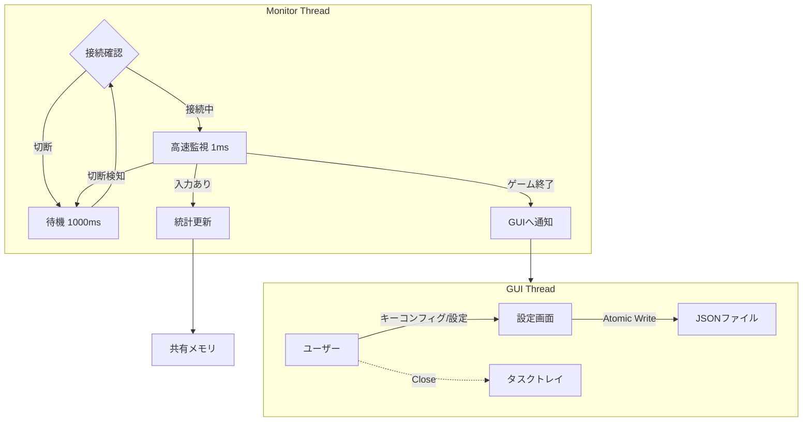

# IIDXコントローラー寿命管理ツール "SwitchLifeManager" 詳細設計書 (Rev. 2)

## 1. プロジェクト概要
本ソフトウェアは、Beatmania IIDX INFINITAS等のリズムゲームで使用されるコントローラーのマイクロスイッチ寿命を可視化・管理するためのツールである。
高精度の入力監視によりハードウェアの消耗度を管理し、チャタリング（多重反応）を検出する。
Rev.2では、接続安定性、汎用的なキーマッピング、データの安全な保存に重点を置いた設計とする。

## 2. 要件定義

### 2.1 機能要件
    *   **高精度入力監視と接続管理**:
    *   **DirectInput (HID) / XInput ハイブリッド対応**:
        *   **DirectInput (HID)**: デフォルトの入力方式。DJ DAO PhoenixWAN等のIIDXコントローラー（HID準拠）をサポートするため、汎用的なゲームパッドライブラリ (`gilrs` 等) を採用する。
        *   **XInput**: 従来のXInput方式も設定により選択可能として残す。
    *   **ホットプラグ対応**: コントローラーの切断・再接続を動的に検知し、切断中は低負荷待機モードへ移行する。
    *   **ターゲット選択**: 複数のコントローラー接続時に、監視対象（ID指定）を選択可能にする。
* **キーマッピング (Key Config)**:
    * コントローラーごとのボタン配置（物理ボタンIDと論理機能の対応）をユーザーが設定できる機能を持つ。
    * デフォルトプリセット（公式コン、PhoenixWAN等）を用意する。
    * Rev.2では割り当て対象を `XInputGamepad.wButtons`（デジタルボタンのビットマスク）に限定する。
        * Turntableは暫定的に「ボタン（ビットマスク）」として扱い、アナログ軸割り当ては将来拡張とする。
* **チャタリング検出**:
    * リリースから再プレスまでの時間を計測し、閾値（デフォルト15ms）未満をチャタリングとして記録。
    * **統計の取り扱い**: チャタリングとして検出した再プレスは、寿命管理の「意図した押下回数」とは分けるため **`total_presses` には含めない**。
    * **発生率の定義（推奨）**:
        * 押下エッジ基準の比率: `chatter_rate_press_edge = total_chatters / (total_presses + total_chatters)`
        * リリース基準の比率: `chatter_rate_release = total_chatter_releases / total_releases`
        * どちらをUIに出すかは目的次第だが、「離しチャタリング」を知りたい場合はリリース基準が解釈しやすい。
* **寿命可視化**:
    * スイッチカタログ（型番・定格寿命）に基づき、寿命残量を可視化する。
* **プロセス連携・自動レポート**:
    * `bm2dx.exe` の終了を検知し、ウィンドウを自動ポップアップしてレポートを表示。
    * **セッションの定義**: 「ゲームプロセス（`bm2dx.exe`）の起動〜終了」を1セッションとし、`last_session_presses` 等のセッション系カウンタはゲーム起動検知時に0へリセットして終了時にレポートに使用する（累計系カウンタは継続加算）。
* **常駐・トレイ格納**:
    * 「閉じる」でタスクトレイ格納。トレイアイコンから復帰・終了操作。
* **入力テスター機能 (New)**:
    * ゲームプロセスの起動有無に関わらず、コントローラーの入力状態をリアルタイムに可視化する機能。
    * ボタンごとのON/OFF状態をランプ等で表示。
    * チャタリング発生時に視覚的なフィードバック（警告色など）を行う。

### 2.2 非機能要件
* **データ整合性 (Atomic Save)**:
    * データの保存時は「一時ファイル書き込み → リネーム」の手順を踏み、電源断やクラッシュ時のデータ破損（ゼロバイト化）を防止する。
* **低負荷**:
    * 監視スレッドは `sleep` を活用し、CPU使用率を極小化する。
    * 切断時はポーリング頻度を落とす（1ms → 1000ms）。

## 3. アーキテクチャ設計

### 3.1 技術スタック (変更・追加分のみ)
| カテゴリ | 選定技術 | 理由 |
| :--- | :--- | :--- |
| **言語** | Rust | 高速性、メモリ安全性、Win32 APIアクセスの容易さ |
| **GUI** | eframe (egui) | 軽量、即時モードGUI、Rust製 |
| **入力監視** | gilrs / windows-rs | **gilrs**: クロスプラットフォームかつDirectInput/XInput両対応のゲームパッド管理。<br>**windows-rs**: XInput専用モードや低レイヤ操作用。 |
| **プロセス監視** | sysinfo | クロスプラットフォームかつ軽量なプロセス管理 |
| **データ保存** | tempfile + Win32 (`MoveFileExW`) | 一時ファイル生成は `tempfile`、Windowsでの「既存ファイルを置換するアトミックリネーム」は `MoveFileExW(MOVEFILE_REPLACE_EXISTING | MOVEFILE_WRITE_THROUGH)` を使用する |
| **常駐制御** | tray-icon | タスクトレイアイコン管理のデファクトスタンダード |

### 3.2 処理フロー概念図
接続状態（Connected / Disconnected）によるステートマシンを監視スレッドに導入する。



### 3.3 スレッド間共有と同期方針（実装指針）
監視スレッドは高頻度（接続中 1ms）で状態更新を行うため、GUIスレッドとの共有は「低コスト」「読み取り優先」を基本方針とする。

* 共有データは「GUI表示に必要なスナップショット（集計済み）」に限定し、巨大な構造体の頻繁なクローンを避ける。
* 実装候補（いずれか1つに統一）:
    * `RwLock<Snapshot>`: 監視側が短時間で書き換え、GUI側は読取ロックで参照。
    * 参照の差し替え（例: `ArcSwap`）: 監視側が `Snapshot` を生成し参照を原子的に差し替え、GUIはロックなしで読む。
* 監視スレッド→GUI通知（例: 接続状態変化、ゲーム終了検知）は、スナップショットのポーリングではなくチャンネル（`std::sync::mpsc` / `crossbeam_channel`）でイベントとして送る。

状態更新の直列化（実装指針）:

* `Snapshot` はGUIが読むための **読み取り専用ビュー** とし、GUIから直接ミューテートしない。
* ユーザー操作（ターゲット変更、キーマッピング更新、交換/リセット等）は「コマンド」として監視スレッドへ送信し、監視スレッド側で入力処理と同一の文脈で直列に適用する。
    * これにより、統計更新（1ms）と交換/リセットが同時に走ってカウンタが不整合になる競合を避ける。
    * 実装例: `Command::UpdateMapping {..}` / `Command::ReplaceSwitch { logical_key, new_model_id }` / `Command::ResetStats { logical_key }`

`Snapshot` に含める項目（推奨）:

* 接続状態: `Connected/Disconnected`、対象コントローラindex（Player 1〜4相当）
* 最終入力時刻（任意）: 「監視が動いている」ことの可視化用
* ゲーム稼働状態: `GameRunning`（`bm2dx.exe` 検知結果）
* 設定の要約: `chatter_threshold_ms`、polling周期（接続中/切断中）
* マッピングの要約: `profile_name`、各 `LogicalKey -> physical(u16)`（表示に必要な範囲）
* 統計（キーごと）:
    * `total_presses / total_releases / total_chatters / total_chatter_releases / last_session_presses`
    * 寿命可視化に必要な派生値（残量%など）は、GUI側で計算するかSnapshotに含めるかをどちらかに統一
* 保存状態: `last_save_at`、`last_save_result(Ok/Err + message)`
* 直近イベントの要約（任意）: GUIで簡易ログを出す場合のリングバッファ（例: 最大50件）

監視→GUIイベント種別（推奨）:

* `ConnectionChanged(Connected/Disconnected)`
* `TargetControllerChanged(index)`（ユーザー操作で変更した場合の反映用）
* `GameStarted` / `GameExited`（レポート表示トリガ）
* `SaveSucceeded` / `SaveFailed(error)`（オートセーブ/終了時保存の結果通知）

責務分離と更新頻度（実装指針）:

* 監視スレッドは「入力取得・エッジ検出・統計の累積」を担当し、GUIスレッドは「表示」と「ユーザー操作の受付」を担当する。
* GUIは毎フレーム（例: 30〜60Hz）に最新の `Snapshot` を読む前提とし、監視側の1ms更新に追従するための同期待ち（毎msロック取得等）は行わない。
* 寿命残量%やチャタリング率などの派生値は、「GUI側で都度計算」または「監視側で `Snapshot` に含める」のどちらかに統一し、両方で別々に計算しない。

## 4. データ構造設計

### 4.1 データモデルの変更点
「物理ボタンID」と「論理機能（1鍵など）」の結合を疎結合にするため、マッピング定義を分離する。

* **LogicalKey**: アプリケーションが扱う論理的なキー（Key1, Key2, Turntable...）。
* **ButtonMap**: 物理ボタンID（ビットマスク）とLogicalKeyの対応表。
* **Atomic Persistence**: 保存時は必ず `.tmp` ファイルを経由する。

補足（実装上の注意）:

* JSONのオブジェクトキーは文字列であるため、`HashMap<LogicalKey, ...>` をそのまま `serde` に任せると、`Other(u16)` の表現が想定（例: `"Other-12"`）と一致しない。
    * 対応策: `LogicalKey` に `Display`/`FromStr` を実装し、`serde_with::DisplayFromStr` 等で **必ず文字列キー** としてシリアライズする。
    * あるいは JSON側を配列形式（`[{"logical":"Key1","physical":4096}, ...]`）にして、キーを文字列にしない。
    * 本設計のJSON例では `mapping.bindings` と `switches` の両方がこの影響を受ける（どちらも `LogicalKey` をキーにするため）。

* XInputのボタンは `wButtons`（16bitビットマスク）で表現されるため、物理ボタンIDは基本的に `u16` を前提にする。
    * ただしトリガーやスティックはアナログ値であり、ビットマスクとは別系統の扱いになる（Turntableをアナログ軸で取りたい場合は別マッピング種別が必要）。

* `schema_version` は永続化フォーマットのバージョンである。
    * フィールド追加・名称変更等の破壊的変更が入る場合は、この値を上げて読み込み時にマイグレーションする。
    * 未知の `schema_version` を読み込んだ場合は、データ破損を避けるため **読み込みを中止** し、ユーザーへエラー表示する。

メンテナンス（交換）と統計のスコープ（仕様）:

* `switches[LogicalKey].stats.total_*` は「現在装着されているスイッチ（現行個体）」に対する累計とし、スイッチ交換を行った場合は **0へリセット** する。
    * リセット対象: `total_presses / total_releases / total_chatters / total_chatter_releases / last_session_presses`
* 交換操作では `switch_model_id` を更新できる（同型へ交換した場合も記録目的で実施可能）。
* 交換によるリセットは不可逆とし、実行前に確認ダイアログを出す。
* 交換前の値は後追いできるよう、少なくともログへ記録する（推奨: 日時、対象 `LogicalKey`、旧/新 `switch_model_id`、交換前の各累計値）。
* 一般的なメンテナンスサイクルの考え方:
    * 定期点検（例: 一定期間ごと）と、状態基準（チャタリング率上昇、寿命バーが閾値を下回る、体感の違和感）を併用し、必要時に交換→リセットを行う。
    * 本ツールは「交換タイミングの判断材料（寿命残量・チャタリング傾向）」を提供し、交換実施後は統計を新しい個体として再スタートできることを保証する。

保存先（実装指針）:

* ユーザーデータはユーザーごとのアプリデータ領域に保存する（例: Windowsは `%LOCALAPPDATA%/SwitchLifeManager/`）。
* 設定・統計のデフォルト保存ファイル例: `profile.json`

```json
{
    "schema_version": 1,
    "config": {
        "target_controller_index": 0,
        "chatter_threshold_ms": 15,
        "polling_rate_ms_connected": 1,
        "polling_rate_ms_disconnected": 1000
    },
    "mapping": {
        "profile_name": "Custom IIDX Mapping",
        "bindings": {
            "Key1": 4096,
            "Key2": 8192,
            "Turntable": 64
        }
    },
    "switches": {
        "Key1": {
            "switch_model_id": "omron_d2mv_01_1c3",
            "stats": {
                "total_presses": 150200,
                "total_releases": 150199,
                "total_chatters": 12,
                "total_chatter_releases": 10,
                "last_session_presses": 450
            }
        },
        "Key2": { ... }
    }
}
```

```rust
// 論理キーの定義
#[derive(Hash, Eq, PartialEq, Clone, Serialize, Deserialize)]
enum LogicalKey {
    Key1, Key2, Key3, Key4, Key5, Key6, Key7,
    Turntable,
    Start, Select, E1, E2,
    // JSONキーとして使うため、文字列化の考慮が必要 (例: "Other-12")
    Other(u16)
}

// データルート
struct UserProfile {
    schema_version: u32,
    config: AppConfig,
    mapping: ButtonMap,
    switches: HashMap<LogicalKey, SwitchData>,
}

struct ButtonMap {
    profile_name: String,
    bindings: HashMap<LogicalKey, u16>, // Logical -> Physical(Bitmask)
}

struct SwitchData {
    switch_model_id: String,
    stats: ButtonStats,
}
```

## 5. ロジック詳細設計

### 5.1 堅牢な監視ループ (Monitor Loop)
1.  **接続チェック**: `XInputGetState(target_index)` を実行。
2.  **エラーハンドリング**:
    * `ERROR_SUCCESS`: **接続中モード**へ。
        * タイマー精度は「接続状態に入ったタイミング」で `timeBeginPeriod(1)` を有効化し、「切断へ遷移したタイミング」で `timeEndPeriod(1)` を呼び戻す。
        * 入力判定ロジック実行（前回設計同様）。
        * `sleep(1ms)`。
    * `ERROR_DEVICE_NOT_CONNECTED`: **切断モード**へ。
        * GUIステータスを「切断中」に更新。
        * `sleep(1000ms)`（再接続待ちのCPU負荷低減）。
3.  **状態遷移時の処理**:
    * 切断 → 接続: プロセス監視やタイマー精度設定を再初期化。

補足（実装上の注意）:

* キー割り当てや統計更新で「押下エッジ」を使うため、`wButtons` の現在値だけでなく前回値を保持し、`pressed = (now & !prev)` のように立ち上がりを検出する。
* 1msスリープは環境により揺れるため、実測で許容できない場合は待機戦略（`sleep` + 誤差吸収、または高分解能タイマー）を検討する。

停止・例外経路（実装指針）:

* 常駐や終了処理を考慮し、監視スレッドは「停止要求」を受け取って安全に抜けられる構造にする（例: `AtomicBool` の終了フラグ + チャンネルによる即時wake）。
* `timeBeginPeriod(1)` / `timeEndPeriod(1)` は呼び忘れがシステム全体に影響するため、可能ならRAIIで管理し「スレッド終了・エラー時でも必ず `timeEndPeriod`」が実行されるようにする。

離しチャタリングの計測（推奨アルゴリズム）:

* ボタンごとに `last_release_at`（直近のリリース時刻）と `chatter_cooldown_until` を保持する。
* リリースエッジ検出時:
    * `total_releases += 1`
    * `last_release_at = now`
* プレスエッジ検出時:
    * `now < chatter_cooldown_until` の間は、押下・チャタリングのどちらも数えない（多重バウンスによる過剰カウント抑制）。
        * 本仕様では、cooldown期間に発生した「本物の再押下」も統計上は無視してよい前提とする（IIDX用途での過剰カウント抑制を優先）。
    * `last_release_at` があり、`now - last_release_at < chatter_threshold_ms` の場合:
        * `total_chatters += 1`
        * このリリースで初めてのチャタリングなら `total_chatter_releases += 1`
        * **このプレスは `total_presses` に含めない**
        * `chatter_cooldown_until = now + chatter_threshold_ms`（または固定ガード時間）
    * 上記以外の場合:
        * `total_presses += 1`

### 5.2 安全なファイル保存 (Atomic Write)
1.  データ保存リクエスト発生（終了時、オートセーブ）。
2.  `tempfile::Builder` を使用し、**保存先ディレクトリ内**に一時ファイルを作成（クロスデバイスエラー回避）。
3.  JSONシリアライズしてTempFileに書き込み。
4.  `flush` の後、可能なら `sync_all` でファイル内容をディスクへフラッシュする（耐障害性向上）。
5.  置換リネームを実行する。
    * Windows: `MoveFileExW(tmp, dest, MOVEFILE_REPLACE_EXISTING | MOVEFILE_WRITE_THROUGH)` により **既存ファイルを置換** する。
    * Windows以外: `std::fs::rename(tmp, dest)`（同一ディレクトリ内であれば原子的に置換される）
6.  失敗時はエラーログを出力し、元のファイルを保持する。

運用上の追加指針:

* `sync_all` は「一時ファイル」に対して行う。必要に応じて「保存先ディレクトリの `sync_all`」も検討する（クラッシュ耐性向上）。
* 置換リネームが失敗する場合（他プロセスが掴む等）に備え、短いリトライ（例: 3回、各50〜100ms待ち）を入れるかどうかを実装で選択する。
* 保存失敗はサイレントにせず、GUI側で分かる形にするため「最後の保存結果（成功/失敗メッセージ・時刻）」を状態として保持する。

## 6. UI/UX設計

### 6.1 キーコンフィグ画面 (Key Config Modal)
* **UI構成**:
    * 左側: 論理キーリスト（1鍵、2鍵...）。
    * 右側: 現在割り当てられているボタンID。
* **設定フロー**:
    1.  ユーザーがリストから「1鍵」を選択し「設定」ボタンを押下。
    2.  ダイアログ「コントローラーのボタンを押してください...」を表示。
    3.  アプリは全ボタン入力を監視（前回状態との差分で「新しく押されたボタン」を検出）。
    4.  最初に検出した押下エッジのビットマスクを取得し、マッピングを更新。
        * 押しっぱなし状態を誤って拾わないよう、ダイアログ表示時点の `wButtons` を基準（初期値）として除外する。

同時押し・重複割り当ての扱い（仕様）:

* **同時押し**: 1回の監視周期（1ポーリング）で押下エッジが複数ビット検出された場合は、誤割り当て防止のため **無効** とし、「1つだけ押してください」と再入力を促す（マッピングは変更しない）。
* **重複割り当て**: ある物理ボタンが既に別の論理キーへ割り当て済みの状態で新規割り当てが発生した場合、設定の一貫性のため **新しい割り当てを優先** し、既存の割り当て（旧論理キー側）は自動的に解除する。

ユーザーへの通知（実装指針）:

* 同時押しで無効になった場合、および重複割り当てにより旧割り当てが解除された場合は、ユーザーが理由を理解できるように画面内に短いメッセージを表示する（例: ステータス表示または簡易ログ欄）。

### 6.2 メイン画面のステータス表示
* ヘッダー部にインジケータを追加。
    * 🟢 **Connected (Player 1)**: 正常監視中。
    * 🔴 **Disconnected**: コントローラー未検出。
    * 🔵 **Game Running**: INFINITAS起動中。

### 6.3 メンテナンス操作（交換/リセット）
* 寿命管理の前提として、各論理キー（スイッチ）に対して「交換/リセット」操作を提供する。
* 操作内容:
    * 対象 `LogicalKey` を指定して実行。
    * 確認ダイアログで「交換に伴い累計が0へ戻る」ことを明示する。
    * 必要に応じて新しい `switch_model_id` を選択/入力し、確定時に `stats.total_*` を0へリセットする。
* 実行結果（成功/失敗）はステータス/簡易ログ欄へ表示し、詳細はログへ残す。
* 同期（実装指針）:
    * 交換/リセットはGUIが直接データを書き換えるのではなく、監視スレッドへコマンド送信して適用する（統計更新との競合回避）。

### 6.4 入力テスター画面 (Input Tester)
* **目的**: ゲームを起動せずにスイッチの反応やチャタリングを確認するための診断モード。
* **表示内容**:
    * 定義された各 `LogicalKey` に対応するインジケータ（未押下: グレー/消灯, 押下中: 点灯）。
    * チャタリング検出時のフラッシュ表示（短時間 赤色表示など）。
    * 生のボタンID（ビットマスク）の表示（デバッグ用）。

## 7. 実装ロードマップ (Rev. 2)

1.  **Phase 1: コア & データ保全**
    * データ構造の実装（LogicalKey, Atomic Write）。
    * 監視スレッドの実装（切断時の待機ロジック含む）。
2.  **Phase 2: GUI & キーコンフィグ**
    * `eframe` 基本実装。
    * **キー割り当て設定画面**の実装（これが無いと実機テストが困難なため前倒し）。
    * リアルタイム入力モニター（デバッグ用）。
3.  **Phase 3: 完成度向上**
    * メインダッシュボード（寿命バー表示）。
    * プロセス監視と自動ポップアップ。
    * トレイ格納機能。

## 8. 運用・ログ設計（実装指針）
* 予期しない切断、保存失敗、`schema_version` 不一致、プロセス監視の例外等は、ユーザー報告に必要な情報としてログに残す。
* スイッチ交換（統計リセット）も、後追い可能な監査情報としてログに残す（日時、対象キー、旧/新 `switch_model_id`、交換前の累計値）。
* ログ出力先はユーザーデータ保存先と同一ディレクトリ（例: `app.log`）を基本とする。
* GUI上には直近の重要イベント（保存成功/失敗、接続状態変化、ゲーム開始/終了、交換/リセット）だけを要約表示し、詳細はログで追えるようにする。