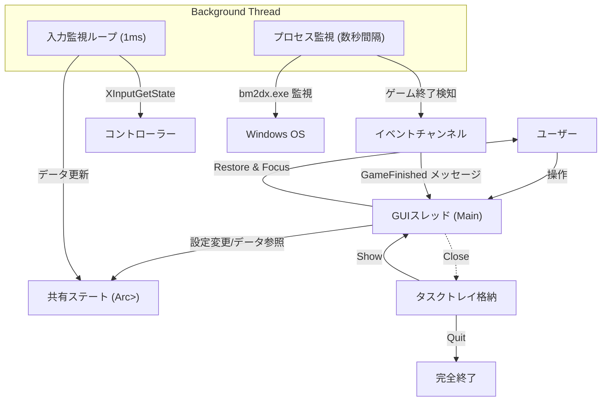

# 1. 設計書：基本情報・要件定義

# IIDXコントローラー寿命管理ツール "SwitchLifeManager" 詳細設計書

## 1. プロジェクト概要
本ソフトウェアは、Beatmania IIDX INFINITAS等のリズムゲームで使用されるコントローラーのマイクロスイッチ寿命を可視化・管理するためのツールである。
高精度の入力監視により、ハードウェアの消耗度（寿命残量）を定量的に把握し、メンテナンス時期の判断を支援する。また、スイッチの劣化による多重反応（チャタリング）を検出し、プレイヤーに警告する機能を持つ。

## 2. 要件定義

### 2.1 機能要件
* **高精度入力監視**:
    * XInput対応コントローラーの入力を1ms以下の精度で監視する。
    * ボタンごとの累積押下回数を記録する。
* **チャタリング検出**:
    * 「ボタンが離されてから再度押されるまでの時間」を計測する。
    * 設定された閾値（デフォルト15ms）未満の入力を「チャタリング（多重反応）」として検出し、別途カウントする。
* **寿命可視化**:
    * スイッチの型番（カタログスペック）と現在の入力数を比較し、寿命残量をパーセンテージおよび色で可視化する。
* **プロセス連携**:
    * `bm2dx.exe` (INFINITAS) の起動・終了を自動検知する。
    * ゲーム終了時に自動でウィンドウをポップアップし、セッションレポートを表示する。
* **常駐・トレイ格納**:
    * ウィンドウの「閉じる」ボタン押下時はアプリを終了せず、タスクトレイに格納する。
    * タスクトレイアイコンまたはメニューから再表示可能とする。

### 2.2 非機能要件
* **低負荷**: ゲームプレイに影響を与えないよう、監視スレッドのCPU負荷を極小化する（タイマー制御によるスリープ活用）。
* **低遅延**: 入力遅延を発生させないよう、入力フックではなく読み取り専用（Polling）方式を採用する。
* **データ保全**: アプリ終了時およびゲーム終了時にデータを自動保存し、データロストを防ぐ。

## 3. アーキテクチャ設計

### 3.1 技術スタック
| カテゴリ | 選定技術 | 理由 |
| :--- | :--- | :--- |
| **言語** | Rust | 高速性、メモリ安全性、Win32 APIアクセスの容易さ |
| **GUI** | eframe (egui) | 軽量、即時モードGUI、Rust製 |
| **入力監視** | windows-rs (XInput) | 最もオーバーヘッドが低い入力取得方法 |
| **プロセス監視** | sysinfo | クロスプラットフォームかつ軽量なプロセス管理 |
| **データ保存** | serde_json | 構造体の容易なシリアライズ/デシリアライズ |
| **常駐制御** | tray-icon | タスクトレイアイコン管理のデファクトスタンダード |

### 3.2 処理フロー概念図
メインスレッド（GUI）とバックグラウンドスレッド（監視）を分離し、`Arc<Mutex<>>` および `Channel` で連携する。



## 4. データ構造設計

### 4.1 データモデル
設定と統計データを分離し、JSON形式で永続化する。

* **SwitchCatalog**: マイクロスイッチのスペック定義（マスタデータ）
* **ButtonStats**: ボタンごとの統計情報（累積数、チャタリング数）
* **Config**: ユーザー設定（監視対象プロセス名、閾値など）

```json
{
  "config": {
    "chatter_threshold_ms": 15,
    "target_process_name": "bm2dx.exe",
    "polling_rate_ms": 1
  },
  "buttons": {
    "0": { // XInput Button ID
      "label": "1鍵 (Key 1)",
      "switch_model_id": "omron_d2mv_01_1c3",
      "stats": {
        "total_presses": 150200,    // 累積打鍵数
        "total_chatters": 12,       // 累積チャタリング数
        "last_session_presses": 450 // 直近のゲームでの打鍵数
      }
    },
    "1": { "label": "2鍵 (Key 2)", ... }
  }
}
```
```rust
// アプリケーション全体の状態
struct AppState {
    config: AppConfig,
    buttons: HashMap<usize, ButtonData>,
    dirty: bool, // 保存が必要かどうかのフラグ
}

struct ButtonData {
    label: String,
    switch_model: SwitchSpec,
    stats: ButtonStats,
    // ランタイム用: チャタリング判定のためのタイムスタンプ
    #[serde(skip)]
    last_release_time: Option<Instant>,
}

struct ButtonStats {
    total_presses: u64,
    total_chatters: u64,
    current_session_presses: u64,
}
```

## 5. ロジック詳細設計

### 5.1 チャタリング検出アルゴリズム (入力監視ループ)
1.  `timeBeginPeriod(1)` でシステムタイマー精度を向上。
2.  1msごとに `XInputGetState` を実行。
3.  前回フレームとのビット差分 (`XOR`) を取得。
4.  **ボタンが離された (Release) 瞬間**:
    * 現在時刻 (`Instant::now()`) を `last_release_time` に記録。
5.  **ボタンが押された (Press) 瞬間**:
    * カウントアップ (`total`, `session`)。
    * `Instant::now()` と `last_release_time` の差分 (`delta`) を計算。
    * `delta < chatter_threshold_ms` (例: 15ms) の場合、**チャタリング**としてカウントアップ。

### 5.2 ウィンドウ制御ロジック (Close to Tray)
`eframe` の `close_requested` イベントをフックして実装する。

1.  ユーザーが「×」ボタンをクリック。
2.  `ctx.input(|i| i.viewport().close_requested())` が `true` になる。
3.  アプリ終了フラグ (`can_exit`) を確認。
    * `false` の場合: `ctx.send_viewport_cmd(CancelClose)` および `Visible(false)` を発行 → **トレイ格納**。
    * `true` の場合: そのまま終了（トレイメニューの「終了」からのみ `true` になる）。

## 6. UI/UX設計

### 6.1 メインダッシュボード (Grid Layout)
IIDXコントローラーの物理配置を模したグリッドレイアウトを採用する。

* **各ボタンカードの表示項目**:
    * ラベル (例: "1鍵")
    * 寿命プログレスバー (緑 > 黄 > 赤)
    * 数値: `現在数 / 公称寿命` (例: 1.2M / 10M)
    * チャタリング発生時は警告アイコン (⚠️) を点灯。
* **フッター**:
    * 直近セッション（ゲームプレイ）の合計打鍵数を表示。

### 6.2 タスクトレイメニュー
* **Show**: ウィンドウを表示し、フォーカスを当てる。
* **Quit**: データを保存し、アプリケーションを完全に終了する。

## 7. 実装ロードマップ

1.  **Phase 1: コアロジック (CLI)**
    * JSON設定ファイルの読み書き実装。
    * XInput監視とチャタリング検出の実装。
2.  **Phase 2: GUIプロトタイプ**
    * `eframe` + `tray-icon` の統合（Close to Trayの実装）。
    * グリッドレイアウトの作成。
3.  **Phase 3: 統合と洗練**
    * プロセス監視と自動ポップアップの実装。
    * スイッチカタログの実装。
    * 実機（INFINITAS）での動作検証。