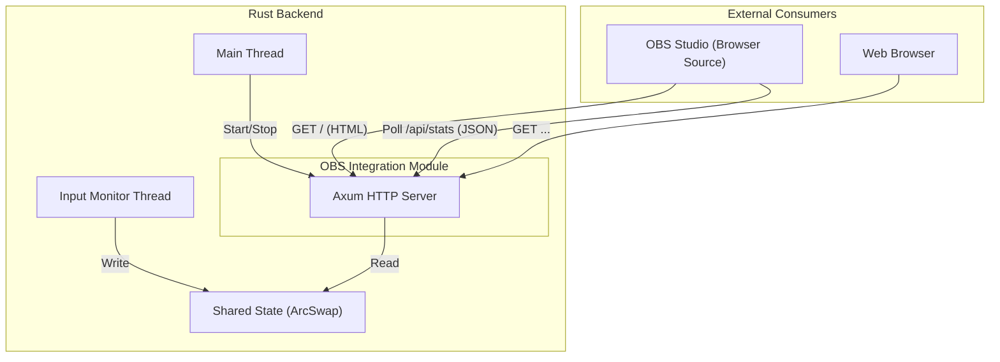

# OBS Integration Design Document

**Status:** Draft
**Target:** SwitchLifeManager (Tauri v2)

## 1. 概要
OBS Studio などの配信ソフトで「現在のセッション統計」を表示するための機能を提供する。
アプリケーション内に軽量な HTTP サーバーを組み込み、OBS の「ブラウザソース」から参照可能な HTML および JSON データを提供する。

**主な要件:**
*   ユーザーが機能の ON/OFF を切り替えられること。
*   使用するポート番号を変更できること。
*   ゲームプレイやメインアプリへの負荷を最小限に抑えること。
*   **UI構成の再定義**: 以下の6つのセクションに機能を分離する。
    1.  **Dashboard**: 全期間の統計情報・寿命管理（セッション情報は含まない）。
    2.  **Tester**: 入力テスター。
    3.  **Live Session**: リアルタイムのセッション情報（OBSオーバーレイと同期）。
    4.  **Past Sessions**: 過去のセッション履歴リストと詳細表示。
    5.  **Maintenance**: メンテナンス（スイッチ交換・リセット）記録。
    6.  **Settings**: 設定画面。

## 2. アーキテクチャ

### 2.1 全体構成
Tauri アプリケーション (Backend process) のバックグラウンドスレッドとして HTTP サーバーを起動する。



### 2.2 コンポーネント設計

#### A. HTTP Server (Backend)
*   **Framework**: `axum` (軽量・高速・非同期)
*   **Binding**: `127.0.0.1` (ローカルホストのみ)
*   **Port**: デフォルト `36000` (設定により変更可能)
*   **Lifecycle**:
    *   アプリ起動時: 設定 (`obs_enabled`) に基づき自動起動。
    *   設定変更時: ON/OFF 切り替えやポート変更時に再起動。

#### B. Endpoints

| Method | Path | Description |
| :--- | :--- | :--- |
| `GET` | `/` | オーバーレイ表示用の HTML ファイルを返す。 |
| `GET` | `/api/stats` | 現在のセッション統計とメタデータ（推奨ポーリング間隔など）を含む JSON データを返す。 |
| `GET` | `/overlay.css` | (Optional) スタイルシート。HTMLにインライン化しても良い。 |
| `GET` | `/overlay.js` | (Optional) フロントエンドロジック。HTMLにインライン化しても良い。 |

#### C. Overlay Frontend (HTML/TypeScript)
*   **Technology**: TypeScript (Vanilla) + Vite
*   **Reason**: 配列や型定義(`SharedState`の型など)をメインアプリと共有し、開発効率と保守性を高めるため。Reactは使用せず、DOM操作を直接行うことで軽量さを維持する。
*   **Behavior**:
    1.  ロード時に静的な HTML 構造を描画。
    2.  初回ロード時、およびレスポンスヘッダやJSON内の指定 (`poll_interval_ms`) に基づく間隔で `/api/stats` をポーリング。
    3.  **Visual**: 単なる数値リストではなく、キーごとの押下回数を積み上げ棒グラフ（Bar Chart）等で視覚的に表現する。
        *   ゲーム起動中(`is_game_running: true`)のみ数値を更新・表示する。
        *   ゲーム未起動時は「Waiting...」等の待機表示、または数値をクリアして表示する（前回のセッション情報は表示しない）。

### 2.3 データフロー
1.  **Monitor Thread** が入力を検知し、`SharedState` を更新する (1ms 周期)。
2.  **OBS Browser Source** が `/api/stats` をリクエストする (例: 1000ms 周期)。
3.  **HTTP Server** が `SharedState` の最新スナップショットを取得し、JSON レスポンスを生成する。
    *   **Locking Strategy**: `ArcSwap` の `load()` を使用するため、Monitor Thread の書き込みをブロックしない (Wait-free reader)。

## 3. 設定項目 (AppConfig)

`AppConfig` 構造体に以下のフィールドを追加する。

```rust
struct AppConfig {
    // ...existing fields
    
    // OBS Integration
    pub obs_enabled: bool,          // default: false
    pub obs_port: u16,              // default: 36000
    pub obs_poll_interval_ms: u64,  // default: 1000, range: 100-5000
}
```

## 4. 構成設定 (Configuration)
**保存先**: `AppConfig` (既存)

| 設定項目 | 型 | デフォルト | 説明 |
| :--- | :--- | :--- | :--- |
| `obs_enabled` | `bool` | `false` | OBSサーバー機能の有効化 |
| `obs_port` | `u16` | `36000` | HTTPサーバーのポート番号 |
| `obs_poll_interval_ms` | `u64` | `1000` | ブラウザソースのポーリング間隔 (100ms - 5000ms) |

### 5. UI/UX (オーバーレイ & Live Session)
**コンセプト**: シンプルかつ視認性の高いバーチャート

*   **統合**: 本機能はメインアプリの「Live Session」タブおよび、OBSブラウザソースとして提供されるオーバーレイの両方で共有されるビジュアルデザインを持つ。
*   **表示内容**:
    *   **Live Sessionタブ**: アプリ内でリアルタイム統計を表示。
    *   **OBSオーバーレイ**: 上記と同じ内容をブラウザソースとして提供。
    *   **状態反映**: ゲーム起動中(`is_game_running: true`)のみ更新。未起動時は待機表示。
*   **ビジュアル**:
    *   キーごとに縦棒グラフを表示。
    *   現在のプレス数を表示。
    *   最大値(Max)に対する割合で高さを決定（動的スケール）。

## 5. セキュリティとパフォーマンス

*   **セキュリティ**:
    *   `127.0.0.1` にバインドすることで、外部ネットワークからのアクセスを遮断する。
    *   HTTPS は使用しない (OBS の内部ブラウザとの互換性・証明書管理の手間を回避)。
*   **パフォーマンス**:
    *   `/api/stats` は単なるメモリアクセスと JSON シリアライズのみであり、計算コストは無視できるレベル。
    *   ポーリング頻度はクライアント (OBS) 依存だが、1秒間隔程度を想定。

## 6. 実装フェーズ

1.  **Backend**: `axum` 依存関係の追加、`ObsServer` 構造体の実装。
2.  **Backend**: `SharedState` へのアクセスと JSON レスポンスの実装。
3.  **Overlay**: 静的 HTML/CSS/JS の作成と埋め込み (Rust バイナリに `include_str!` 等で埋め込むか、アセットとして配置)。
4.  **Frontend**: 設定画面の UI 実装と IPC 連携。
